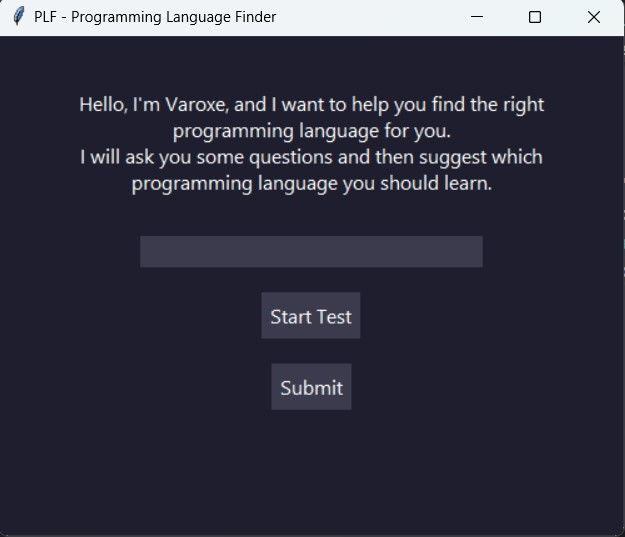

<h1>PLF - Programming Language Finder by <strong>Varoxe</strong></h1>

The <strong>Programming Language Finder (PLF)</strong> is a simple desktop application developed with Python and Tkinter to help users determine the best programming language to learn based on their interests. The app asks users a series of questions and recommends the right language for different fields like web development, game development, mobile apps, AI, and more.

<h2>Features</h2>
<ul>
    <li>Interactive question-based flow to determine the user's interest</li>
    <li>Recommends programming languages for various fields such as:
        <ul>
            <li>Web development</li>
            <li>Game development</li>
            <li>Mobile app development</li>
            <li>Software development</li>
            <li>Artificial Intelligence (AI)</li>
            <li>Automation</li>
        </ul>
    </li>
    <li>Simple and modern GUI with a dark theme</li>
    <li>Clear and structured code that is easy to extend</li>
</ul>

<h2>Technologies Used</h2>
<ul>
    <li><strong>Python</strong>: The primary programming language for the project.</li>
    <li><strong>Tkinter</strong>: For creating the graphical user interface (GUI).</li>
</ul>

<h2>How to Run the Project</h2>
<ol>
    <li>Ensure you have Python installed on your machine. If not, download and install it from <a href="https://www.python.org/downloads/">here</a>.</li>
    <li>Download or clone this repository to your local machine.</li>
    <li>Install the necessary Python modules by running the following command in your terminal:
        <pre><code>pip install tkinter</code></pre>
    </li>
    <li>Navigate to the project folder and run the <code>.py</code> file:
        <pre><code>python plf_app.py</code></pre>
    </li>
    <li>The application window should open, and you can start interacting with the app!</li>
</ol>

<h2>How to Use the App</h2>
<ol>
    <li>Launch the app by running the script.</li>
    <li>Click on <strong>Start Test</strong> to begin.</li>
    <li>Answer the question by entering a number corresponding to your interest (e.g., 1 for web development, 2 for game development, etc.).</li>
    <li>Click <strong>Submit</strong> after providing your response.</li>
    <li>The app will recommend the most suitable programming language for you based on your answer.</li>
</ol>

<h2>Screenshots</h2>

    Below is a screenshot of the current version of the <strong>Programming Language Finder</strong>:

<h2>Contributing</h2>

    Contributions are welcome! If you have any ideas, bug reports, or want to extend the app, feel free to fork this repository and submit a pull request.

<h2>License</h2>

    This project is open-source and available under the GNU License</a>.

